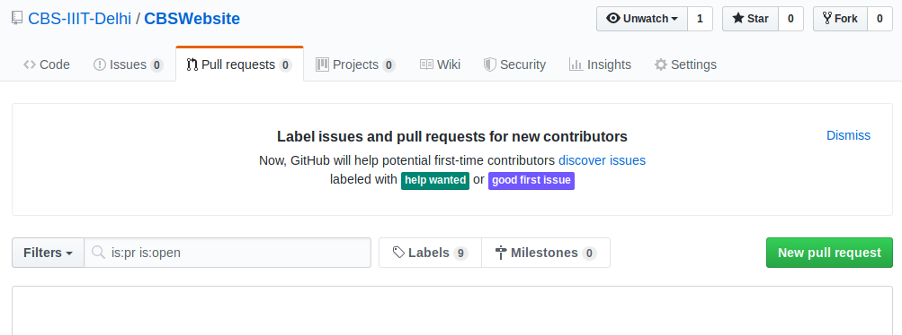
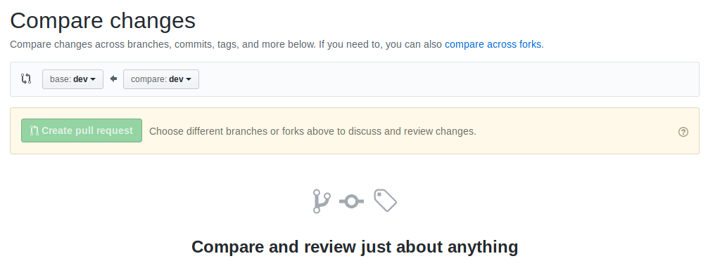
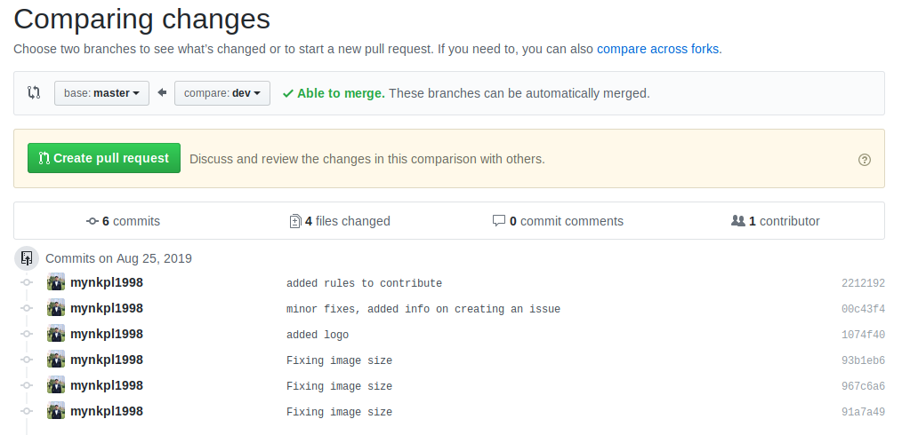
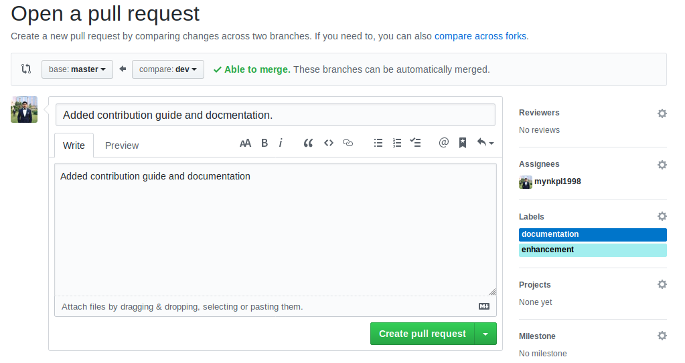

## Introduction

Welcome to the documentation of Cyber Physical Systems Lab website. This document provides the documentation to the different components of the website to the contributors. Refer to [contribution guide](ContributionGuide.md) if you have any question regarding the contribution practices or how to contribute.

## Creating a pull request

Once, you have pushed the code to the development branch. Now, it's time to a create pull request to merge code into master branch. 
1. To create a pull request, click on pull request tab and click on `New Pull Request`.

2. After that, it wil ask you to choose base branch which is master in our case and compare branch is dev.

3. Make sure to set the base and compare branch correctly. After that you will be able to see all the changes you made which are in dev but not in master.

4. Hit on create pull request and fill in the title and description which summarizes what these changes will bring into master branch. Select a reviewer (one or more super users) and assign it to one of the super user who will merge the changes. Select an appropriate label describing the category of the changes (bug, feature etc.). Hit create.

## Running website locally

Navigate to the root directory of the repository and then run the http server.
1. For Python 3 or Above.

    `python -m http.server`
2. For Python 2 

    `python -m SimpleHTTPServer`